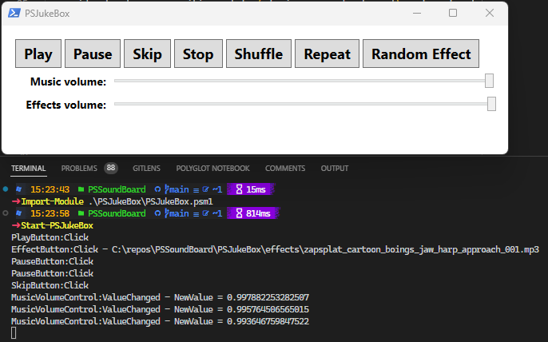

# PSJukeBox Sample

## Introduction

This is a very basic sample of a WPF-based user interface invoking PSSoundBoard
cmdlets to play, pause, and skip tracks, play sound effects, and control volume
of music and effects independently.



## Usage

To test this sample UI, import the module and call `Start-PSJukeBox`:

```powershell
Import-Module PSJukeBox.psm1
Start-PSJukeBox
```

## Known issues

While creating this sample there were some obvious areas of improvement:

- It would be nice to have a cmdlet to retrieve current media player state which
  provides track name, position, state (playing, paused, stopped), volume levels,
  and current shuffle/repeat status.
- The current playlist and position in the playlist with a "Next up" property.
- Adjustable sound-effect pool size. Maybe it's not unusual to have more than 5
  effects playing at once and you want to set the pool size to 10? Or allow the
  pool initialize to a specific size but allow it to grow as needed.
- Allow sound effects to be loaded into memory instead of played from disk. This
  looks like it would require the use of a SoundPlayer instance which only
  supports WAV files though.

## Attributions

The music and sound effects used in the PSJukeBox sample WPF application were
obtained from [Zapsplat.com](https://www.zapsplat.com).
